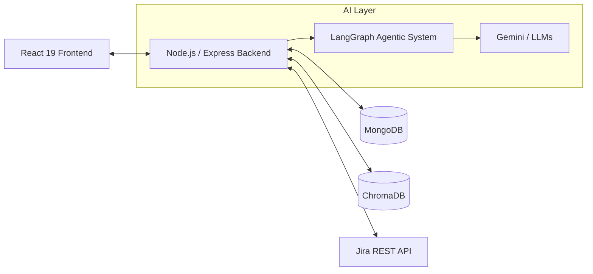
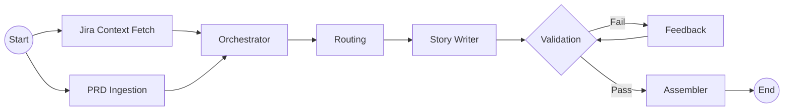

# AI Scrum Assistant

_A Multi-Agent, AI-Powered Scrum Companion for Jira_

> A full-stack, agentic AI system that automates backlog refinement, PRD parsing, sprint planning, and chat-based agile management — built with Node.js, LangChain.js (LangGraph), Google Gemini, Mongoose, Jira OAuth (3LO), and a modern React 19 frontend.

---

## 🎯 Overview

The **AI Scrum Assistant** is a modern, multi-agent application designed to act as a *virtual Scrum Master* and Agile powerhouse. By leveraging advanced Agentic workflows (via LangGraph) alongside your Jira workspace, it minimizes administrative overhead, helping Agile teams focus on delivering value rather than writing tickets or analyzing sprint metrics manually.

### Target Personas & Uses

- **Product Managers**: Automate backlog creation from PRDs. Upload a PRD, and watch the AI break it down into Epics, Stories, and Acceptance Criteria based on historical team capacity.
- **Scrum Masters**: Generate daily standup summaries and sprint retrospectives instantly. The AI synthesizes recent Jira status changes, comments, and metrics to auto-generate reports.
- **Developers**: Ask chat questions about the current sprint, specific Jira tickets, or blockers, receiving context-aware answers grounded in your Jira data.

---

## 🏗️ Core Architecture & Tech Stack

The system follows a modern MERN-like stack supercharged by a specialized LangGraph AI orchestrator.

### System Architecture Overview



### Frontend
- **Framework**: React 19 + Vite + TypeScript
- **Styling**: Tailwind CSS v4
- **State Management**: Zustand
- **Routing**: React Router v7

### Backend
- **Framework**: Node.js + Express (ESM)
- **Database**: MongoDB (via Mongoose)
- **Authentication**: JWT & Atlassian OAuth (3LO)
- **API Clients**: `jira.js`

### AI & Agentic Layer
- **Orchestration**: LangChain.js & LangGraph (`@langchain/langgraph`)
- **LLM Providers**: Google Gemini (`@langchain/google-genai`), OpenRouter
- **Vector Database**: ChromaDB (Semantic duplicate detection & RAG)
- **Parsers**: Zod, `pdf-parse`

---

## 🌟 Key Features

1. **Agentic Backlog Generation (LangGraph)**
   - **Multi-Agent Pipeline**: Uses a stateful LangGraph graph to process PRDs (Text/PDF).
   - **Intelligent Breakdown**: The Orchestrator node plans Epics based on Jira context (velocity, cadence), while Story Writer nodes concurrently draft individual tickets.
   - **Self-Correction loop**: A Validation node checks generated stories against Agile best practices. If a story fails, a Feedback node instructs the Story Writer to revise it (up to 3 retries).
   - **Real-Time Observability**: UI dashboard streams the live execution state of the AI's "thought process" via Server-Sent Events (SSE).

2. **Atlassian OAuth Integration**
   - Securely log in using your Jira account (3LO).
   - Seamlessly switch between different Atlassian Cloud workspaces/boards.

3. **Intelligent Chatbot Interface**
   - A dedicated Chat space to ask the AI questions about your Jira projects.
   - Chat history and separated sessions are saved so you never lose context.

4. **Agile Reporting & Sprint Planning**
   - Extracts sprint issues to calculate velocity, completion rates, and spillovers.
   - **Daily Standups**: AI-generated standup reports synthesizing recent Jira status changes and comments.
   - **Retrospectives**: Automated "What Went Well" and "Actionable Insights" structured templates analyzing closed sprints.

---

## 🤖 LangGraph Workflow


*(For a deeper dive into the agentic system, see [LangGraph Agentic System](docs/langgraph_agentic_system.md))*

---

## 🔐 Setup & Installation

### Prerequisites
- **Node.js**: v18 or higher recommended.
- **MongoDB**: A local instance or MongoDB Atlas cluster.
- **Docker**: For running the ChromaDB vector server.
- **Atlassian Developer App**: An app created in Atlassian Developer console with OAuth 2.0 (3LO) integration and required Jira REST API scopes.
- **AI Keys**: A Google Gemini API Key and/or OpenRouter API Key.

### 1. Vector Database Setup
Run ChromaDB using Docker on port 8000:
```bash
docker run -d --name chroma -p 8000:8000 chromadb/chroma
```
*(To stop: `docker stop chroma` | To start again: `docker start chroma`)*

### 2. Environment Variables
Create a `.env` file in the `server/` directory:
```env
PORT=2000
MONGODB_URI=mongodb+srv://<username>:<password>@cluster...
DB_NAME=ass-project
JWT_SECRET=YOUR_SECURE_JWT_SECRET
ATLASSIAN_CLIENT_ID=your_atlassian_client_id
ATLASSIAN_CLIENT_SECRET=your_atlassian_client_secret
ATLASSIAN_REDIRECT_URI=http://localhost:5173/oauth/callback
FRONTEND_SUCCESS_URL=http://localhost:5173/oauth/success
GOOGLE_API_KEY=your_google_api_key
OPENROUTER_API_KEY=your_openrouter_api_key
```

### 3. Application Initialization
**Terminal 1 (Backend):**
```bash
cd server
pnpm install
pnpm run dev
```

**Terminal 2 (Frontend):**
```bash
cd client
npm install
npm run dev
```

*(Note: Use `pnpm` in the server directory as per project guidelines).*

Access the application in your browser at `http://localhost:5173`.

---

## 📂 Project Structure

```text
ai-scrum-assistant/
├── server/                   # Orchestration, AI logic, and APIs
│   ├── src/
│   │   ├── backlog-generator/ # LangGraph Agentic System
│   │   ├── controllers/      # Route logic handlers
│   │   ├── routes/           # Express API endpoints
│   │   ├── services/         # Modular services
│   │   └── ...
│   └── package.json
├── client/                   # React 19 Client
│   ├── src/
│   │   ├── components/       # Reusable UI parts & layouts
│   │   ├── pages/            # Core views
│   │   └── store/            # Zustand global stores
│   └── package.json
├── docs/                     # Architectural Documentation
└── README.md
```

---

## ChromaDB Per-Board Collections

RAG data is organized per Jira board to isolate context and improve retrieval relevance:

- Legacy collection: `scrum_knowledge_base_v2`
- Board-scoped collections: `scrum_knowledge_base_board_<boardId>`

When board context is available, retrieval queries use the matching board collection. A legacy fallback remains enabled for backward compatibility when board-scoped data is not available yet.

To migrate shared legacy data:

```bash
cd server
pnpm run migrate:rag:boards -- --defaultBoardId=<board-id>
```

Use `--dryRun=true` first to validate migration behavior without writes.
