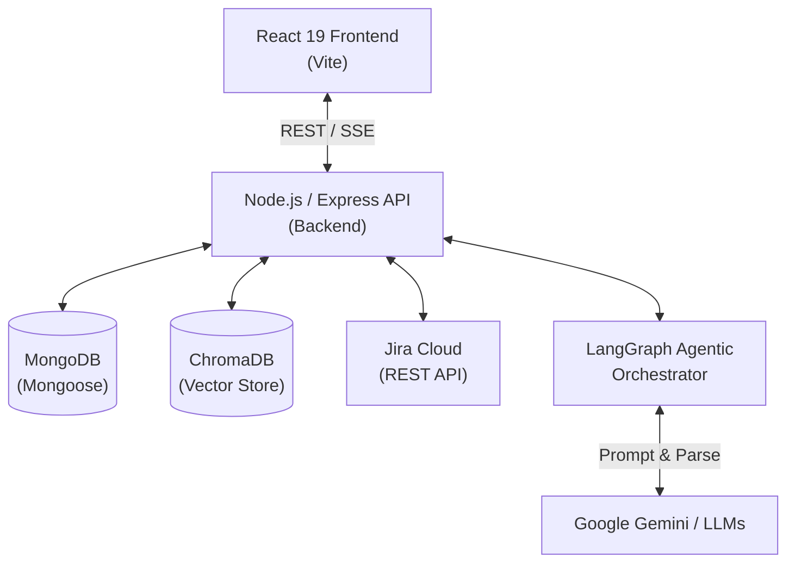
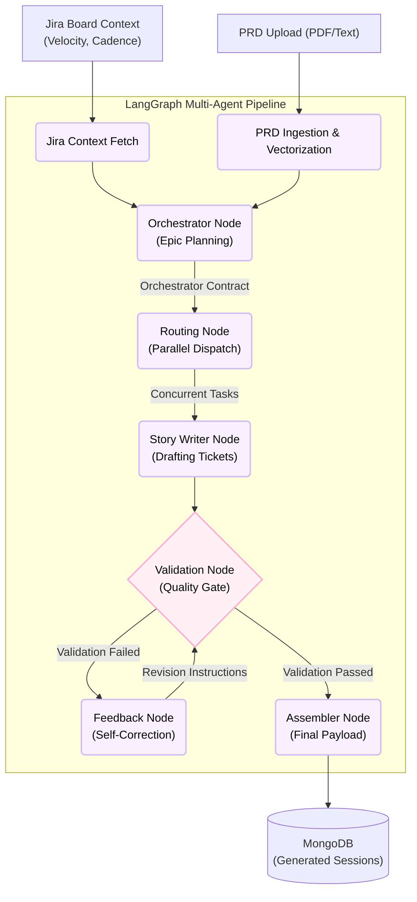

# AI Scrum Assistant

      

AI Scrum Assistant is a multi-agent, AI-powered Scrum companion designed to automate backlog refinement, PRD parsing, sprint planning, and chat-based agile management through intelligent LangGraph workflows and seamless Jira integration.

---

## Product Overview

### The Problem We Are Solving
Agile teams spend countless hours on administrative overhead. Product managers and engineers manually translate Product Requirement Documents (PRDs) into Jira user stories, break them down into subtasks, and estimate points. Scrum Masters struggle to compile accurate daily standup summaries or end-of-sprint retrospective reports from fragmented Jira comments and status transitions. Traditional Jira workflows require heavy manual data entry, slowing down development cycles and pulling focus away from actually writing code.

### Our Solution
The AI Scrum Assistant acts as a virtual, tireless Scrum Master. It connects securely to your Atlassian workspace via native OAuth, continuously analyzing your board's context. Marketers and Product Managers can upload raw PRDs (Text or PDF) and let the system automatically generate comprehensive, validated ticket hierarchies (Epics → Stories → Tasks). Furthermore, it provides an intelligent conversational layer over your Jira data to summarize sprints, run standups, and unblock developers instantly.

### How We Are AI-Native
AI isn't just an afterthought feature—it's the core orchestrator of the platform.
- **Multi-Agent Orchestration:** We utilize a stateful LangGraph agentic system. Different LLM nodes act as the Orchestrator, Writer, and Validator, working concurrently to draft and self-correct tickets before they reach your backlog.
- **Retrieval-Augmented Generation (RAG):** Sprint histories, board context, and PRD contents are vectorized using ChromaDB. This allows the built-in Copilot to answer complex agile queries with highly accurate, grounded context.
- **Automated Validation & Feedback Loops:** The system features an AI-driven quality gate. If a generated user story lacks clear acceptance criteria or violates agile sizing principles, a Feedback node automatically instructs the Story Writer node to revise it, mimicking a real peer-review process.

---

## Core Features

- **Agentic Backlog Generation:** Uses LangGraph to intelligently parse PRDs, evaluate historical team velocity, and break down requirements into actionable Jira Epics, Stories, and Acceptance Criteria.
- **Zero-Friction Authentication:** Leverages Atlassian OAuth 2.0 (3LO) for highly secure, token-less sign-ins and seamless multi-workspace swapping.
- **Context-Aware AI Copilot:** A conversational interface equipped with RAG capabilities. Ask the AI questions about your current sprint, specific Jira tickets, or blockers, and receive data-backed answers.
- **Automated Agile Reporting:** Analyzes recent Jira issue transitions, comments, and metrics to auto-generate daily standup summaries and structured sprint retrospectives.

---

## System Architecture

The AI Scrum Assistant is built on a modern MERN stack, supercharged by an asynchronous AI orchestration pipeline using LangChain.js and LangGraph.

### High Level Architecture 



### Detailed Agentic Architecture (LangGraph)



### Real-Time Observability via SSE
Executing a multi-step LangGraph agentic flow can take time. To provide an exceptional UX, the backend utilizes an `agentEventBus` to stream Server-Sent Events (SSE) to the React client. The UI renders a live, glowing dashboard of the AI's "thought process"—showing exactly which nodes are active, how many stories are being drafted, and if any are failing validation.

### Per-Board RAG Architecture
To ensure high accuracy in chat and reporting, ChromaDB collections are dynamically scoped per Jira Board (e.g., `scrum_knowledge_base_board_<boardId>`). This prevents context bleeding across different teams or projects in a multi-tenant workspace.

---

## Quick Start

### Prerequisites
- Node.js 18+
- PostgreSQL/MongoDB (MongoDB Atlas or local)
- Docker (for ChromaDB)
- Atlassian Developer App (OAuth 2.0 / 3LO Integration)
- Google Gemini API Key (or OpenRouter)

### Setup

**1. Vector Database Setup**
Run ChromaDB using Docker on port 8000:
```bash
docker run -d --name chroma -p 8000:8000 chromadb/chroma
```

**2. Clone & Install**
```bash
# Install Server dependencies (Note: We use pnpm for the server)
cd server
pnpm install

# Install Client dependencies
cd ../client
npm install
```

**3. Environment Variables**
Create `.env` in `server/`:
```env
PORT=2000
MONGODB_URI=mongodb+srv://<username>:<password>@cluster...
DB_NAME=ass-project
JWT_SECRET=YOUR_SECURE_JWT_SECRET
ATLASSIAN_CLIENT_ID=your_atlassian_client_id
ATLASSIAN_CLIENT_SECRET=your_atlassian_client_secret
ATLASSIAN_REDIRECT_URI=http://localhost:5173/oauth/callback
FRONTEND_SUCCESS_URL=http://localhost:5173/oauth/success
GOOGLE_API_KEY=your_google_api_key
OPENROUTER_API_KEY=your_openrouter_api_key
```

**4. Run the Application**
```bash
# Terminal 1: Start Backend API
cd server
pnpm run dev

# Terminal 2: Start React Frontend
cd client
npm run dev
```

Access the application at `http://localhost:5173`.

---

## Core User Journeys

1. **The Automated Backlog Pipeline:** A Product Manager uploads a multi-page PRD PDF. The `prd_ingestion` node vectorizes it, the `orchestrator` analyzes the team's historical velocity from Jira, and the `story_writer` agents concurrently draft 20 Jira stories. The validation node catches 2 oversized stories and sends them back for revision before presenting the final, polished backlog for approval.
2. **The 30-Second Standup:** A Scrum Master opens the application before the morning meeting. With one click, the system queries the Jira API for the last 24 hours of transitions and comments, passing it through an LLM to generate a bulleted summary of exactly who did what, and what is currently blocked.
3. **Interactive Agile Chat:** A Developer is confused about the acceptance criteria of their assigned ticket. They open the Copilot chat and ask, "What are the core requirements for ticket ABC-123 based on the original PRD?" The agent searches ChromaDB, synthesizes the PRD and the ticket, and answers immediately.
4. **Frictionless Ticket Syncing:** After reviewing the AI-generated Epics and Stories, the user clicks "Push to Jira." The backend executes a heavily parallelized routine using `jira.js` to create the Epics, retrieve their cloud IDs, and map them to the newly created Child Stories in seconds.

---

## Technical Documentation

Explore the `docs/` directory for a deep dive into implementation details:

1. [LangGraph Agentic System Architecture](docs/langgraph_agentic_system.md)
2. [Server & Monolith Architecture Overview](docs/SERVER_ARCHITECTURE.md)
3. [Jira OAuth 3LO Flow](docs/jira_oauth_architecture.md)
4. [Jira Hierarchy Integration Strategy](docs/JiraHierarchyIntegration.md)
5. [Backlog Crafting Architecture](docs/backlog_crafting_architecture.md)
6. [AI Agent Details & Prompts](docs/ai_agent_details.md)

---

## Testing

The project uses Node.js built-in test runner (`node:test`) with `node:assert/strict`.

### Run Tests

```bash
cd server

# Unit tests (no external services needed)
npm run test:unit

# Health checks (needs Redis, MongoDB, ChromaDB running)
npm run test:health

# Integration tests (mocked, some need env vars)
npm run test:integration

# Everything
npm run test:all
```

### Test Structure

```
server/test/
├── unit/                        # Pure logic, no mocks needed
│   ├── tokenizer.test.js        # Token estimation
│   ├── velocityRef.test.js      # Velocity calculation
│   ├── validation.test.js       # Story validation rules
│   ├── state.test.js            # StateAnnotation reducers
│   ├── schemas.test.js          # Zod schema validation
│   ├── ticketTransformer.test.js # JIRA payload transforms
│   ├── auth.middleware.test.js  # JWT auth
│   ├── generateToken.test.js   # JWT generation
│   └── agentEventBus.test.js   # Event bus state
├── integration/
│   ├── health/                  # Infrastructure health
│   │   ├── redis.health.test.js
│   │   ├── mongodb.health.test.js
│   │   ├── chromadb.health.test.js
│   │   └── jira.health.test.js
│   ├── jiraClient.test.js       # JIRA SDK with mocks
│   ├── hierarchy.service.test.js # Epic/Story/Subtask
│   └── backlog.controller.test.js # Controller logic
└── helpers/                     # Shared test utilities
    ├── mockReqRes.js
    ├── mockJiraClient.js
    └── mockModels.js
```

### Health Checks

Health tests verify that external services are reachable:

| Service | What it checks |
|---------|---------------|
| **Redis** | `PING`, `SET/GET`, `INFO` |
| **MongoDB** | Connection, `ping()`, CRUD |
| **ChromaDB** | `heartbeat()`, collection create/delete |
| **JIRA** | Credentials present, API reachable, auth valid |

---

## Architecture Trade-offs (Speed vs Scale)

In order to rapidly prototype this complex platform, several intentional engineering trade-offs were made. The following breakdown contrasts our current architecture with the requirements for massive enterprise scale.

### 1. Agent Execution & HTTP Lifecycles
- **Current Architecture:** The LangGraph execution stream blocks the initial HTTP request lifecycle, emitting Server-Sent Events (SSE) back to the client directly from the main API process. 
- **Enterprise Scale:** Heavy agentic workflows should never block the Node.js event loop or hold HTTP connections open indefinitely. We would decouple the graph execution into isolated background workers (e.g., BullMQ or Temporal) and utilize WebSockets to stream state updates asynchronously to the frontend.

### 2. Jira API Rate Limiting & Synchronization
- **Current Architecture:** When the AI needs Jira context, it fetches data synchronously from the Jira REST API in real-time. Pushing a massive backlog to Jira also executes concurrently against Jira's API.
- **Enterprise Scale:** Mass concurrent requests can trigger Atlassian's rate limits. We would implement a webhook-based synchronization service to maintain a read-optimized replica of Jira issues in our own PostgreSQL database, enabling instant AI queries without hitting external APIs. Write operations would be routed through a rate-limited dispatch queue.

### 3. Vector Database Management
- **Current Architecture:** We utilize a local, Dockerized instance of ChromaDB to handle vector embeddings and RAG. 
- **Enterprise Scale:** Exact nearest-neighbor vector search is computationally expensive. We would offload embedding storage to a managed Vector Database (e.g., Pinecone, Milvus) to handle multi-tenant scaling securely with isolated namespaces per workspace.

### 4. LLM Generation and Rate Limits
- **Current Architecture:** The system heavily utilizes `Promise.all` to fan out multiple concurrent LLM calls (e.g., in the Routing and Story Writer nodes). 
- **Enterprise Scale:** Massive parallelization can overwhelm standard LLM provider rate limits (Tokens-per-minute / Requests-per-minute). We would implement a sophisticated LLM Gateway with exponential backoff, request queuing, and semantic caching (using Redis) to avoid redundant token generation for similar queries.
