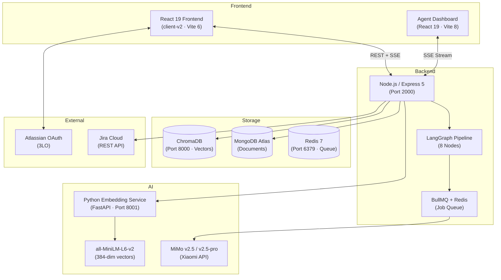
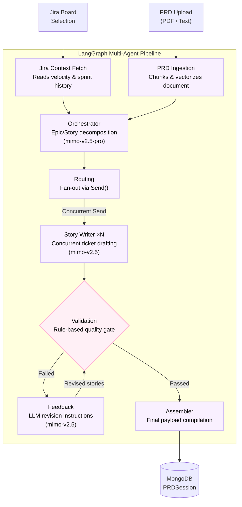

# AI Scrum Assistant

      

A multi-agent, AI-powered Scrum companion that automates backlog refinement, PRD parsing, sprint planning, and chat-based agile management through LangGraph workflows and Jira integration.

---

## Table of Contents

- [Product Overview](#product-overview)
- [What the App Can Do](#what-the-app-can-do)
- [System Architecture](#system-architecture)
- [Tech Stack](#tech-stack)
- [Project Structure](#project-structure)
- [Quick Start](#quick-start)
- [Environment Variables](#environment-variables)
- [Running with Docker Compose](#running-with-docker-compose)
- [Core User Journeys](#core-user-journeys)
- [Testing](#testing)
- [CI/CD](#cicd)
- [Technical Documentation](#technical-documentation)
- [Architecture Trade-offs](#architecture-trade-offs)

---

## Product Overview

### The Problem

Agile teams spend countless hours on administrative overhead. Product managers manually translate PRDs into Jira user stories, break them into subtasks, and estimate points. Scrum Masters compile standup summaries from fragmented Jira comments and status transitions. Traditional Jira workflows require heavy manual data entry, slowing development cycles.

### The Solution

AI Scrum Assistant acts as a virtual Scrum Master. It connects to your Atlassian workspace via OAuth, analyzes your board's context, and uses a multi-agent LangGraph pipeline to generate, validate, and push complete ticket hierarchies. It also provides an AI copilot over your Jira data for instant sprint summaries, standups, and blocker identification.

---

## What the App Can Do

### 1. Automated Backlog Generation from PRDs
- Upload a PRD (PDF or plain text) and optionally attach supporting business documents
- The LangGraph pipeline reads the PRD, analyzes your team's velocity from Jira, and generates a full hierarchy: **Epics → Stories → Subtasks** with acceptance criteria and story points
- Concurrent story writers draft tickets in parallel; a validation + feedback loop self-corrects poor stories (up to 3 revisions)
- Real-time SSE dashboard shows exactly which pipeline node is active, what's being drafted, and what failed

### 2. AI Copilot Chat (RAG-Powered)
- Conversational interface grounded in your Jira data and uploaded PRDs
- Ask questions like *"What are the acceptance criteria for ticket ABC-123?"* or *"Summarize blockers in this sprint"*
- Uses ChromaDB vector search with per-board collection isolation to prevent context bleeding
- Can draft new backlog items interactively through chat

### 3. Daily Standup Generation
- One-click generation of standup summaries from the last 24 hours of Jira activity
- Categorizes issues into: **Done**, **In Progress**, **Blocked**
- Powered by LLM analysis of Jira transitions and comments

### 4. Sprint Retrospective Reports
- Generates structured retrospective reports with metrics: planned vs completed story points, velocity, bug count, blocked count
- Produces **What Went Well** and **Actionable Insights** sections

### 5. Jira Integration (Push & Sync)
- Push AI-generated Epics, Stories, and Subtasks directly to Jira with proper parent-child linking
- Uses Jira REST API V3 with ADF format for descriptions
- Create Meta for issue type discovery, exponential backoff retry logic
- Supports both Atlassian OAuth 2.0 (3LO) and Basic Auth paths

### 6. Real-Time Agent Dashboard
- Standalone React app that visualizes the LangGraph pipeline execution via SSE
- Shows node statuses: waiting (gray), active (glowing), completed (green), failed (red)

### 7. Document Management
- Upload and manage business documents that provide additional context for backlog generation
- Documents are vectorized and stored in ChromaDB for RAG retrieval

---

## System Architecture

### High-Level Architecture



### LangGraph Pipeline (8 Nodes)



### Dual Embedding Strategy

The system uses two separate embedding paths:

| Path | Model | Dimensions | Storage | Purpose |
|------|-------|-----------|---------|---------|
| **Embedding Service** (Python) | `all-MiniLM-L6-v2` | 384 | ChromaDB | Persistent RAG knowledge base across sessions (tickets, sprints, PRDs, business docs) |
| **In-Pipeline** (LangGraph) | `text-embedding-3-small` (OpenAI) | — | In-memory vector store | Session-scoped PRD chunk retrieval during orchestration |

The Python embedding service runs as a standalone FastAPI server. The Node.js backend calls it via HTTP (`embeddingClient.js`) with retry logic (2 retries, 1s delay). ChromaDB collections are dynamically scoped per Jira Board (`scrum_knowledge_base_board_<boardId>`) to isolate context across teams.

### Job Queuing

- **BullMQ + Redis** handles rate-limited LLM calls in the Story Writer and Feedback nodes (concurrency: 3, 10 jobs/60s)
- A separate push queue manages Jira issue creation with rate limiting
- Redis also handles general caching

---

## Tech Stack

### Backend (Node.js)
| Technology | Version | Purpose |
|-----------|---------|---------|
| Node.js | 22 | Runtime |
| Express | 5 | HTTP framework |
| LangChain.js | 1.5 | LLM orchestration |
| LangGraph | 1.4.7 | Multi-agent graph execution |
| MiMo v2.5 / v2.5-pro | — | LLM for story generation (via OpenAI-compatible API) |
| BullMQ | 5.79 | Job queue (Redis-backed) |
| Mongoose | 9.7 | MongoDB ODM |
| ChromaDB | 3.4 | Vector database client |
| jira.js | 5.3 | Jira REST API SDK |
| Zod | 3.25 | Schema validation |
| pdfreader | 3.0 | PDF text extraction |

### Embedding Service (Python)
| Technology | Version | Purpose |
|-----------|---------|---------|
| Python | 3.11 | Runtime |
| FastAPI | — | HTTP framework |
| sentence-transformers | — | Model loading & inference |
| all-MiniLM-L6-v2 | — | 384-dim sentence embeddings |
| uvicorn | — | ASGI server |

### Frontend — client-v2 (Primary)
| Technology | Version | Purpose |
|-----------|---------|---------|
| React | 19 | UI framework |
| TypeScript | 5.7 | Type safety |
| Vite | 6 | Build tool |
| Zustand | 5 | State management |
| react-router-dom | 7 | Routing |
| react-markdown | 9 | Markdown rendering |
| lucide-react | 0.468 | Icons |

### Frontend — agent-dashboard
| Technology | Version | Purpose |
|-----------|---------|---------|
| React | 19 | UI framework |
| Vite | 8 | Build tool |
| SSE | — | Real-time pipeline visualization |

### Infrastructure
| Technology | Purpose |
|-----------|---------|
| MongoDB Atlas | Document database (cloud) |
| Redis 7 | Job queue + caching |
| ChromaDB | Vector database |
| Docker Compose | Local development stack |
| GitHub Actions | CI/CD pipelines |
| Vercel | Frontend deployment |

---

## Project Structure

```
AI-Scrum-Assistant/
├── server/                        # Node.js/Express backend (the core)
│   ├── src/
│   │   ├── index.js               # Entry point — DB connect, cleanup, health checks
│   │   ├── server.js              # Express app — CORS, rate limiting, routes, Swagger
│   │   ├── config/                # db.js, jwt.js, redis.js
│   │   ├── middleware/            # JWT auth middleware
│   │   ├── models/                # User, ChatSession, ChatMessage, PRDSession,
│   │   │                          #   GeneratedBacklog, PushedBacklog, Document
│   │   ├── routes/                # auth, backlog, chat, prd, scrum, document, agentEvents
│   │   ├── controllers/           # Business logic handlers
│   │   ├── services/
│   │   │   ├── ai/                # model.service.js, agent.service.js, chatbot.service.js,
│   │   │   │                      #   rag.service.js, rag.context.js, tools/
│   │   │   └── automation/        # Standup & retrospective generation
│   │   ├── integrations/jira/     # Self-contained Jira layer (routes, controllers, services)
│   │   ├── backlog-generator/     # LangGraph pipeline
│   │   │   ├── nodes/             # jiraFetch, prdIngestion, orchestrator, routing,
│   │   │   │                      #   storyWriter, validation, feedback, assembler
│   │   │   ├── prompts/           # LLM prompt templates
│   │   │   ├── schemas/           # Zod output schemas
│   │   │   ├── utils/             # tokenizer, vectorStore, velocityRef, llmQueue
│   │   │   ├── state.js           # StateAnnotation definition
│   │   │   ├── agentEventBus.js   # SSE event emitter
│   │   │   └── index.js           # Graph compilation & execution
│   │   └── utils/                 # schemas.js, generateToken.js, embeddingClient.js
│   ├── test/                      # Unit, integration, and health tests
│   ├── Dockerfile                 # Multi-stage production build
│   └── package.json
│
├── embedding-service/             # Python FastAPI embedding server
│   ├── app.py                     # FastAPI app — /health, /embed, /embed-query
│   ├── requirements.txt           # Python dependencies
│   └── Dockerfile                 # Python 3.11-slim, pre-downloads model
│
├── client-v2/                     # Primary React frontend
│   ├── src/
│   │   ├── pages/                 # Landing, Login, OAuth, Workspace, Dashboard,
│   │   │                          #   Sprints, Chat, PRD, BacklogReview, Documents, Docs
│   │   ├── components/            # Auth guards, chat (BacklogCard), layout (TopBar)
│   │   ├── api/                   # auth, axios, chat, documents, jira, scrum
│   │   └── stores/                # Zustand stores
│   └── vercel.json
│
├── agent-dashboard/               # Real-time pipeline visualization
│   ├── src/                       # SSE-connected React app
│   └── vercel.json
│
├── client/                        # Original React frontend (v1, legacy)
├── docs/                          # Technical documentation
│   ├── SERVER_ARCHITECTURE.md     # Backend architecture deep-dive
│   ├── langgraph_agentic_system.md # LangGraph pipeline documentation
│   ├── ai_agent_details.md        # Agent setup & prompt design
│   ├── backlog_crafting_architecture.md # Collaborative backlog editing
│   ├── jira_oauth_architecture.md # OAuth 3LO flow
│   ├── JiraHierarchyIntegration.md # Epic/Story/Subtask creation
│   ├── auth_and_api_changes.md    # Auth & API design decisions
│   ├── jira_rest_api_usage.md     # Jira API endpoint mapping
│   ├── USER_MANUAL.md             # End-user guide
│   └── changelog/                 # Release changelogs
│
├── docker-compose.yml             # Full stack: Redis + ChromaDB + Embedding + Server
├── .github/workflows/
│   ├── server-ci.yml              # Server CI: test → build → push Docker image
│   └── embedding-ci.yml           # Embedding CI: test → build → push Docker image
├── scripts/start-app.sh           # Startup script
└── CONTRIBUTING.md
```

---

## Quick Start

### Prerequisites
- Node.js 22+
- pnpm (server package manager)
- Python 3.11+ (for embedding service)
- Docker (for ChromaDB, Redis, and embedding service)
- MongoDB Atlas account (or local MongoDB)
- Atlassian Developer App (OAuth 2.0 / 3LO)
- MiMo API key (from Xiaomi)

### 1. Start Infrastructure Services

```bash
# ChromaDB (vector database)
docker run -d --name chroma -p 8000:8000 chromadb/chroma

# Redis (job queue)
docker run -d --name redis -p 6379:6379 redis:7-alpine

# Embedding service (or run locally — see below)
cd embedding-service
docker build -t embedding-service .
docker run -d --name embedding -p 8001:8001 embedding-service
```

Or run the embedding service locally:
```bash
cd embedding-service
pip install -r requirements.txt
python app.py
```

### 2. Install & Configure the Server

```bash
cd server
pnpm install
cp .env.example .env   # Edit with your values
```

### 3. Install & Run the Frontend

```bash
cd client-v2
npm install
npm run dev
```

### 4. Start the Server

```bash
cd server
pnpm run dev
```

Access the app at `http://localhost:5173`.

---

## Environment Variables

Create `server/.env` with the following:

```env
# ── Server ─────────────────────────────────────────
PORT=2000
NODE_ENV=development

# ── MongoDB ────────────────────────────────────────
MONGODB_URI=mongodb+srv://<user>:<pass>@cluster.mongodb.net/ass-project
DB_NAME=ass-project

# ── Auth ───────────────────────────────────────────
JWT_SECRET=your_secure_jwt_secret

# ── Atlassian OAuth 2.0 (3LO) ─────────────────────
ATLASSIAN_CLIENT_ID=your_atlassian_client_id
ATLASSIAN_CLIENT_SECRET=your_atlassian_client_secret
ATLASSIAN_REDIRECT_URI=http://localhost:5173/oauth/callback
FRONTEND_SUCCESS_URL=http://localhost:5173/oauth/success

# ── LLM (MiMo via Xiaomi) ─────────────────────────
MIMO_API_KEY=your_mimo_api_key
MIMO_API_BASE=https://api.xiaomimimo.com/v1

# ── Embedding Service ─────────────────────────────
EMBEDDING_SERVICE_URL=http://localhost:8001

# ── ChromaDB ──────────────────────────────────────
CHROMA_URL=http://localhost:8000

# ── Redis ─────────────────────────────────────────
REDIS_URL=redis://localhost:6379
```

---

## Running with Docker Compose

The `docker-compose.yml` starts all four services with health checks and dependency ordering:

```bash
docker compose up -d        # Start everything
docker compose logs -f server  # Follow server logs
docker compose down         # Stop everything
docker compose down -v      # Stop + delete data volumes
```

Services started:
| Service | Port | Health Check |
|---------|------|-------------|
| Redis 7 | 6379 | `redis-cli ping` |
| ChromaDB | 8000 | TCP connect |
| Embedding Service | 8001 | `GET /health` |
| Server | 2000 | wget health endpoint |

> **Note:** MongoDB Atlas (cloud) is used — no local MongoDB container. Set `MONGODB_URI` in `server/.env.docker`.

---

## Core User Journeys

### 1. Automated Backlog Pipeline
A Product Manager uploads a multi-page PRD PDF. The `prd_ingestion` node vectorizes it, the `orchestrator` (using mimo-v2.5-pro) analyzes team velocity from Jira, and N `story_writer` agents (using mimo-v2.5) concurrently draft stories. The validation node catches oversized or incomplete stories, sends them to the feedback node for revision, and the assembler compiles the final backlog. The entire process streams to the Agent Dashboard in real-time via SSE.

### 2. 30-Second Standup
A Scrum Master clicks "Generate Standup." The system queries Jira for the last 24 hours of transitions and comments, passes it through an LLM, and produces a bulleted summary: what was done, what's in progress, what's blocked.

### 3. Interactive Agile Chat
A developer asks the copilot: *"What are the core requirements for ticket ABC-123 based on the original PRD?"* The agent searches ChromaDB (per-board collection), synthesizes the PRD context and ticket data, and answers immediately.

### 4. Frictionless Ticket Syncing
After reviewing AI-generated Epics and Stories, the user clicks "Push to Jira." The backend creates Epics first, retrieves their cloud IDs, then creates child Stories and Subtasks with proper parent-child linking, using exponential backoff for rate limit resilience.

---

## Testing

The project uses Node.js built-in test runner (`node:test`) with `node:assert/strict`.

```bash
cd server

# Unit tests (no external services needed)
pnpm run test:unit

# Integration tests (mocked, some need env vars)
pnpm run test:integration

# Health checks (needs Redis, MongoDB, ChromaDB running)
pnpm run test:health

# Everything
pnpm run test:all
```

### Test Structure

```
server/test/
├── unit/                          # Pure logic, no mocks
│   ├── tokenizer.test.js          # Token estimation
│   ├── velocityRef.test.js        # Velocity calculation
│   ├── validation.test.js         # Story validation rules
│   ├── state.test.js              # StateAnnotation reducers
│   ├── schemas.test.js            # Zod schema validation
│   ├── ticketTransformer.test.js  # Jira payload transforms
│   ├── auth.middleware.test.js    # JWT auth
│   ├── generateToken.test.js     # JWT generation
│   └── agentEventBus.test.js     # Event bus state
├── integration/
│   ├── health/                    # Infrastructure health
│   │   ├── redis.health.test.js
│   │   ├── mongodb.health.test.js
│   │   ├── chromadb.health.test.js
│   │   └── jira.health.test.js
│   ├── jiraClient.test.js         # Jira SDK with mocks
│   ├── hierarchy.service.test.js  # Epic/Story/Subtask creation
│   └── backlog.controller.test.js # Controller logic
├── rag-context.test.js            # RAG context building
└── helpers/                       # Shared test utilities
    ├── mockReqRes.js
    ├── mockJiraClient.js
    └── mockModels.js
```

### Health Checks

| Service | What It Checks |
|---------|---------------|
| **Redis** | `PING`, `SET/GET`, `INFO` |
| **MongoDB** | Connection, `ping()`, CRUD |
| **ChromaDB** | `heartbeat()`, collection create/delete |
| **Jira** | Credentials present, API reachable, auth valid |

---

## CI/CD

Two GitHub Actions workflows run on push/PR to `main`:

### Server CI (`server-ci.yml`)
- **Trigger:** Changes to `server/`
- **Job 1:** `pnpm install` → run unit tests
- **Job 2 (main only):** Build Docker image → push to Docker Hub as `ai-scrum-server:latest` + `ai-scrum-server:<sha>`

### Embedding CI (`embedding-ci.yml`)
- **Trigger:** Changes to `embedding-service/`
- **Job 1:** Python 3.11 → `pip install` → smoke test (import app)
- **Job 2 (main only):** Build Docker image → push to Docker Hub as `ai-scrum-embedding:latest` + `ai-scrum-embedding:<sha>`

Both use Docker Buildx with GitHub Actions cache for faster builds.

---

## Technical Documentation

Deep-dive docs in the `docs/` directory:

| Document | Covers |
|----------|--------|
| [SERVER_ARCHITECTURE.md](docs/SERVER_ARCHITECTURE.md) | Backend architecture, all API endpoints, database models, auth flow, AI services, ChromaDB integration, data flow diagrams |
| [langgraph_agentic_system.md](docs/langgraph_agentic_system.md) | 8-node LangGraph pipeline, state schema, reducers, SSE protocol, vector store architecture |
| [ai_agent_details.md](docs/ai_agent_details.md) | `createReactAgent` setup, Gemini quirks, Jira search tool, RAG tool, system prompt design |
| [backlog_crafting_architecture.md](docs/backlog_crafting_architecture.md) | Collaborative backlog editing, BacklogCard component, MongoDB persistence |
| [jira_oauth_architecture.md](docs/jira_oauth_architecture.md) | Atlassian OAuth 2.0 (3LO) 5-step flow, token management, Cloud ID proxy |
| [JiraHierarchyIntegration.md](docs/JiraHierarchyIntegration.md) | Epic/Story/Subtask creation pipeline, ADF format, retry logic |
| [auth_and_api_changes.md](docs/auth_and_api_changes.md) | Zustand 401 interceptor, Basic Auth fallback |
| [jira_rest_api_usage.md](docs/jira_rest_api_usage.md) | All Jira REST API endpoints used, V2 vs V3 breaking changes |
| [USER_MANUAL.md](docs/USER_MANUAL.md) | End-user guide for PMs, Scrum Masters, and Developers |
| [changelog/](docs/changelog/) | Release changelogs |

---

## Architecture Trade-offs

Intentional engineering decisions for rapid prototyping, with notes on enterprise-scale alternatives:

### 1. Agent Execution & HTTP Lifecycles
- **Current:** LangGraph execution blocks the HTTP request lifecycle, emitting SSE directly from the main API process. BullMQ + Redis handles job queuing for LLM calls.
- **Enterprise:** Decouple graph execution into isolated background workers (Temporal, BullMQ scaled workers) and use WebSockets for async state streaming.

### 2. Jira API Rate Limiting
- **Current:** Real-time Jira API fetches for context; concurrent pushes against Jira's API with exponential backoff.
- **Enterprise:** Webhook-based sync service maintaining a read-optimized Jira replica in PostgreSQL; write operations through a rate-limited dispatch queue.

### 3. Vector Database Management
- **Current:** Dockerized ChromaDB with per-board collection isolation.
- **Enterprise:** Managed vector database (Pinecone, Milvus) with isolated namespaces per workspace for multi-tenant scaling.

### 4. LLM Rate Limits
- **Current:** `Promise.all` fan-out for concurrent LLM calls, BullMQ concurrency 3 with 10 jobs/60s rate limit.
- **Enterprise:** LLM gateway with exponential backoff, request queuing, and semantic caching (Redis) to avoid redundant token generation.
