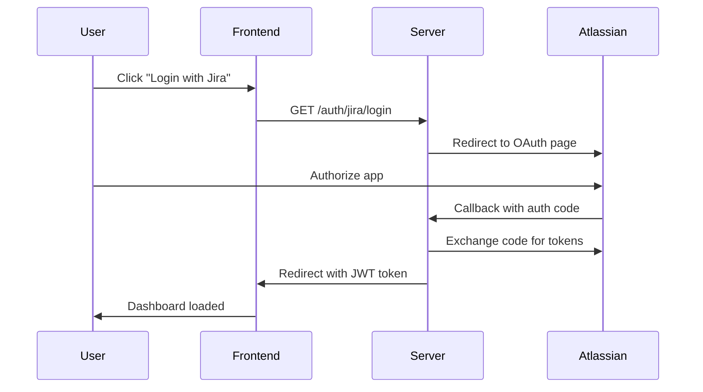
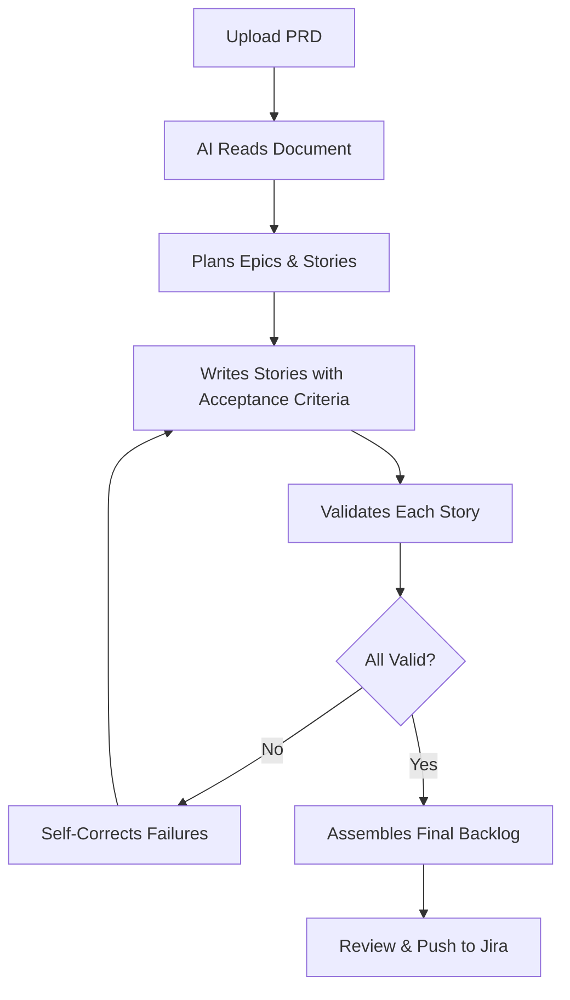
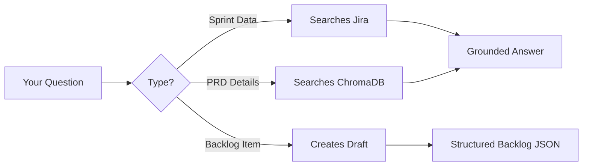
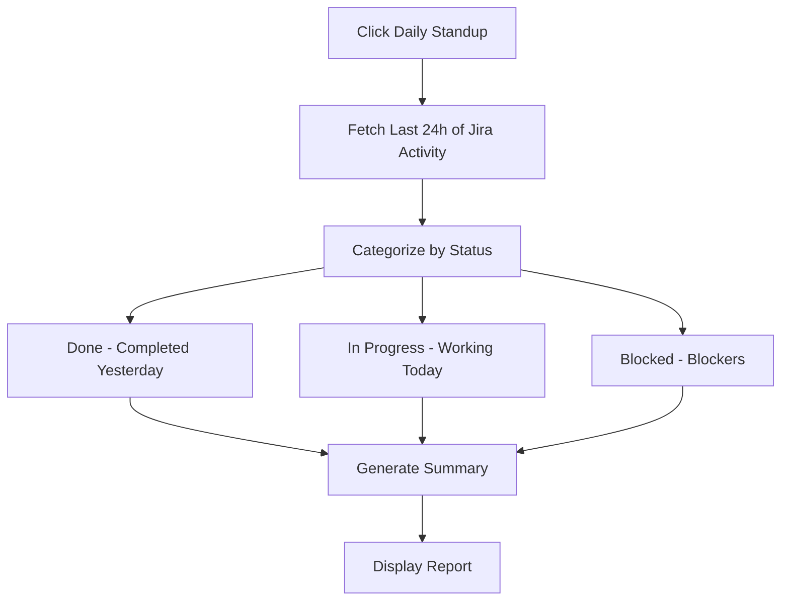
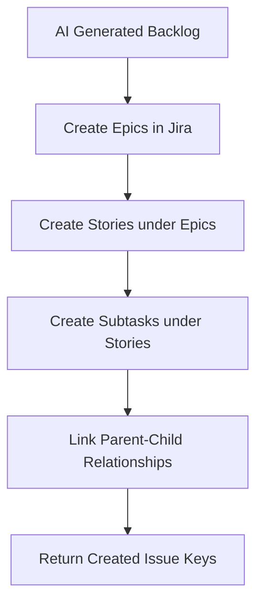
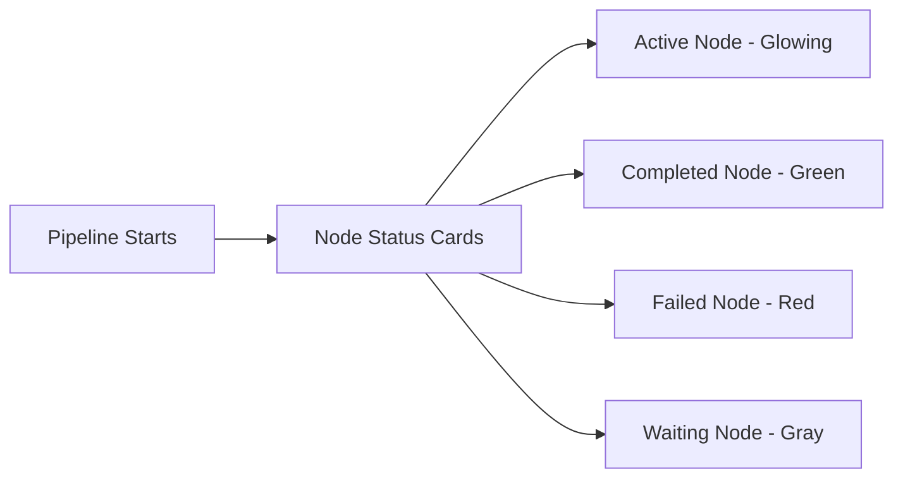

# AI Scrum Assistant — User Manual

> A complete guide for Product Managers, Scrum Masters, and Developers using the AI Scrum Assistant.

---

## Table of Contents

1. [Getting Started](#getting-started)
2. [Generating Backlogs from PRDs](#generating-backlogs-from-prds)
3. [AI Copilot Chat](#ai-copilot-chat)
4. [Daily Standups](#daily-standups)
5. [Sprint Retrospectives](#sprint-retrospectives)
6. [Pushing to Jira](#pushing-to-jira)
7. [Agent Dashboard](#agent-dashboard)
8. [Troubleshooting](#troubleshooting)

---

## Getting Started

### Prerequisites

Before using the AI Scrum Assistant, you need:

| Requirement | Why |
|---|---|
| **Atlassian Account** | For Jira integration (OAuth login) |
| **Jira Board** | The board you want to generate backlogs for |
| **PRD Document** | Product Requirement Document (PDF or text) |

### First-Time Login



**Steps:**
1. Open the application in your browser
2. Click **"Login with Jira"** button
3. You'll be redirected to Atlassian's authorization page
4. Review the permissions and click **"Accept"**
5. You'll be redirected back to the app — now connected to your Jira workspace

### Navigating the Dashboard

The main dashboard has these sections:

| Section | What It Does |
|---|---|
| **Backlog Generator** | Upload PRDs and generate Jira stories |
| **Copilot Chat** | Ask questions about your sprint data |
| **Standup** | Generate daily standup summaries |
| **Retrospective** | Generate sprint retrospective reports |
| **Agent Dashboard** | Monitor AI pipeline execution in real-time |

---

## Generating Backlogs from PRDs

This is the core feature — turning a Product Requirement Document into a complete Jira backlog.

### How It Works



### Step-by-Step

**Step 1: Prepare Your PRD**
- Write a clear Product Requirement Document
- Include: feature descriptions, user flows, business rules, constraints
- Format: Markdown text or PDF

**Step 2: Upload the PRD**
1. Go to **Backlog Generator** in the sidebar
2. Click **"Upload PRD"** or paste text directly
3. Optionally add supporting business documents
4. Select your **Jira Board** from the dropdown
5. Click **"Generate Backlog"**

**Step 3: Watch the AI Work**
The Agent Dashboard shows real-time progress:
- **Jira Context Fetch** — reads your team's velocity and sprint history
- **PRD Ingestion** — chunks and vectorizes your document
- **Orchestrator** — plans Epic/Story breakdown
- **Story Writer** — drafts individual stories (runs in parallel)
- **Validation** — checks each story against agile best practices
- **Assembler** — compiles the final backlog

**Step 4: Review the Results**
- Each story shows: user story, acceptance criteria, subtasks, story points
- Failed stories are flagged with reasons
- You can edit any story before pushing

**Step 5: Push to Jira**
- Click **"Push to Jira"** to create the tickets
- The system creates: Epics → Stories → Subtasks (hierarchical)

### Tips for Better Results

| Tip | Why It Helps |
|---|---|
| **Be specific in your PRD** | Vague PRDs produce vague stories |
| **Include user flows** | Helps AI write proper "As a user..." stories |
| **Add business constraints** | AI respects velocity and capacity limits |
| **Review before pushing** | AI is good but not perfect — always review |

---

## AI Copilot Chat

The Copilot is a conversational AI that understands your Jira data.

### What You Can Ask



**Example Queries:**
- *"What's the status of ticket ABC-123?"*
- *"Summarize the current sprint progress"*
- *"What are the acceptance criteria for the login feature?"*
- *"Draft a user story for password reset"*
- *"What blockers exist in this sprint?"*

### How to Use

1. Go to **Copilot Chat** in the sidebar
2. Type your question in the input field
3. Press **Enter** or click **Send**
4. The AI searches your Jira data and PRD context before answering

### What the Copilot Can't Do

- It can't modify existing Jira tickets (read-only)
- It doesn't have access to code repositories
- It only knows about your current Jira workspace

---

## Daily Standups

Generate standup summaries automatically from Jira data.

### How It Works



### Step-by-Step

1. Go to **Standup** in the sidebar
2. Select your **Project Key** (e.g., `PROJ`)
3. Click **"Generate Standup"**
4. The AI analyzes:
   - Issues completed in the last 24 hours
   - Issues currently in progress
   - Blocked issues and blockers
5. A formatted summary appears

### Understanding the Output

The standup report has three sections:
- **Yesterday** — Issues completed or moved to "Done"
- **Today** — Issues currently "In Progress"
- **Blockers** — Issues blocked by dependencies or problems

---

## Sprint Retrospectives

Generate structured retrospective reports with metrics.

### Metrics Included

| Metric | What It Measures |
|---|---|
| **Planned Story Points** | Total points at sprint start |
| **Completed Story Points** | Points actually delivered |
| **Velocity** | Completion rate (%) |
| **Bug Count** | Bugs found during sprint |
| **Blocked Count** | Issues that were blocked |

### Step-by-Step

1. Go to **Retrospective** in the sidebar
2. Select the **Sprint** from the dropdown
3. Click **"Generate Retrospective"**
4. The AI analyzes sprint data and generates:
   - **What Went Well** — positive outcomes
   - **Actionable Insights** — improvement suggestions

---

## Pushing to Jira

After reviewing AI-generated stories, push them to Jira.

### What Gets Created



**Hierarchy:**
```
Epic: User Authentication
├── Story: Login with Email
│   ├── Subtask: Build login form UI
│   ├── Subtask: Implement auth API
│   └── Subtask: Add error handling
└── Story: Password Reset
    ├── Subtask: Build reset form
    └── Subtask: Implement email sending
```

### Step-by-Step

1. Review the AI-generated backlog
2. Edit any stories that need changes
3. Click **"Push to Jira"**
4. Wait for confirmation — you'll see created issue keys (e.g., `PROJ-123`)
5. Click the issue keys to open them in Jira

### Error Handling

If some tickets fail to create:
- The system retries automatically (up to 3 times)
- Failed tickets are reported with error messages
- Successfully created tickets are still saved

---

## Agent Dashboard

Monitor the AI pipeline execution in real-time.

### What You'll See



### Node Statuses

| Status | Visual | Meaning |
|---|---|---|
| **Waiting** | Gray | Node hasn't started yet |
| **Active** | Glowing orange | Currently executing |
| **Completed** | Green checkmark | Finished successfully |
| **Failed** | Red X | Encountered an error |

### What Each Node Does

| Node | Purpose |
|---|---|
| **Jira Context Fetch** | Reads team velocity and sprint history |
| **PRD Ingestion** | Chunks and vectorizes your document |
| **Orchestrator** | Plans Epic/Story breakdown |
| **Story Writer** | Drafts individual stories (runs N times) |
| **Validation** | Checks stories against agile rules |
| **Feedback** | Fixes failed stories |
| **Assembler** | Compiles final backlog |

---

## Troubleshooting

### Common Issues

| Problem | Solution |
|---|---|
| **"Login failed"** | Check that your Atlassian account has access to the Jira board |
| **"No boards found"** | Ensure you have at least one Jira board in your workspace |
| **"Generation stuck"** | Check the Agent Dashboard — a node may be retrying |
| **"Push failed"** | Verify Jira permissions — you need create access |
| **"Empty response"** | The PRD may be too vague — add more detail |

### FAQ

**Q: How long does backlog generation take?**
A: Depends on PRD size. Small PRDs (1-2 pages) take ~1 minute. Large PRDs (10+ pages) take 3-5 minutes.

**Q: Can I edit AI-generated stories before pushing?**
A: Yes! Always review before pushing. The AI is good but not perfect.

**Q: What if the AI generates wrong stories?**
A: Edit them in the review screen, or regenerate with a more specific PRD.

**Q: Does the AI know about my existing tickets?**
A: Yes — it searches ChromaDB for existing context to avoid duplication.

**Q: Can I use this for multiple Jira boards?**
A: Yes — each board has its own context in ChromaDB (isolated per board).

---

## Quick Reference

### Keyboard Shortcuts

| Shortcut | Action |
|---|---|
| `Enter` | Send chat message |
| `Ctrl + K` | Quick search |

### API Endpoints (for developers)

| Endpoint | Purpose |
|---|---|
| `POST /api/v1/scrum/suggestions` | Upload PRD, get AI suggestions |
| `POST /api/v1/scrum/pushSuggestionsToJira` | Push to Jira |
| `GET /api/v1/scrum/standup` | Generate standup |
| `GET /api/v1/scrum/retrospective` | Generate retrospective |
| `GET /api/v1/events/agent-status` | SSE stream for pipeline status |

---

*For technical architecture details, see [SERVER_ARCHITECTURE.md](./SERVER_ARCHITECTURE.md) and [langgraph_agentic_system.md](./langgraph_agentic_system.md).*
