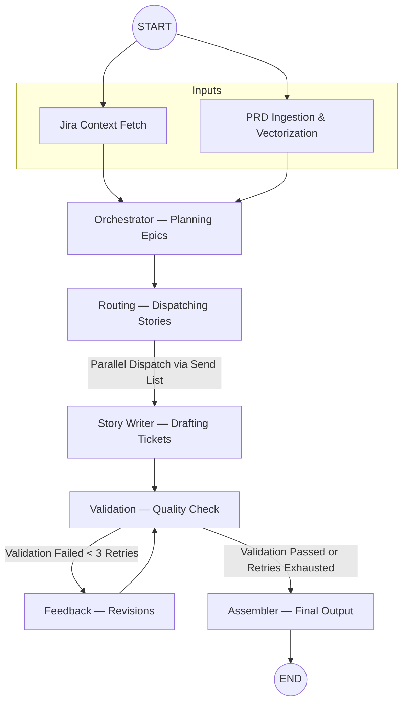

# LangGraph Agentic System

This document outlines the architecture and workflow of the AI Scrum Assistant's LangGraph-based agentic system.

## Overview

The Backlog Generator relies on a stateful, multi-agent graph powered by LangChain and LangGraph. This architecture enables a robust pipeline that can ingest a Product Requirement Document (PRD), fetch context from Jira, intelligently split the PRD into logical Epics and Stories, validate these stories against Agile best practices, and iteratively revise them if they fail validation.

## Architecture & Workflow

The system is defined as a directed acyclic graph (with loops for feedback) where each node performs a specialized function and edges dictate the flow of state between them.

## Node Descriptions

- **Jira Context Fetch (`jira_fetch`)**: Pulls the active team's context from Jira, including velocity, team members, sprint cadence, open bugs, and previous sprint data.
- **PRD Ingestion & Vectorization (`prd_ingestion`)**: Processes the input Product Requirement Document (PRD), calculates token count, categorizes complexity, and processes any supplementary business documents.
- **Orchestrator (`orchestrator`)**: The master planner. It consumes the Jira context and the PRD, generating an overarching orchestrator contract. This contract breaks down the work into Epics and estimates total sprints and capacity required.
- **Routing (`routing`)**: Dispatches the Epic plan into a set of concurrent story-drafting tasks using LangGraph's dynamic `Send` capability.
- **Story Writer (`story_writer`)**: Drafts individual Jira stories, acceptance criteria, subtasks, and assigns story points.
- **Validation (`validation`)**: Acts as a quality gate. It verifies that the drafted stories meet Agile standards, have clear acceptance criteria, and fit within reasonable story point constraints.
- **Feedback (`feedback`)**: If validation fails, this node provides specific feedback to the Story Writer for revisions, enabling an iterative self-correction loop (capped at a maximum number of retries).
- **Assembler (`assembler`)**: Compiles all validated (or finally flagged) stories into a cohesive backlog format ready to be pushed to Jira.

## Observability and Event Bus

The agent uses a Server-Sent Events (SSE) based event bus (`agentEventBus.js`) to stream its progress to the client in real-time. As the graph executes, it emits:
- `run_start`: Initializing the graph.
- `node_start`: Whenever a node begins processing.
- `node_context`: Granular inputs and outputs emitted by the node for UI observability.
- `node_end`: Whenever a node completes.
- `run_end` / `error`: Final execution status.

This allows the UI to display a live dashboard of the AI's "thought process" and execution steps.
